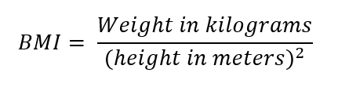
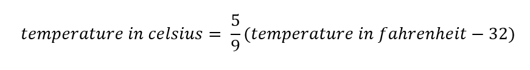

# Operator

#### Q1
Write a program that prompts the user for two numbers. The program then display the sum of the numbers
```
Enter num1: 1
Enter num2: 2
1 + 2 = 3
```

#### Q2
Write a program that ask the user to input the length of the square. The code will then display the area (in cm2) and perimeter (in cm) of the square
```
What is the length of the square (in cm): 5
The area if the square is 25 cm2
The perimeter of the square is 20cm
```

#### Q3
Write a program that ask the user to input two number and multiply them together. The program then displays the result in the following format
```
Enter first number: 2
Enter second number: 3
The product of 2 and 3 is 6
```

#### Q4
Your weight is the amount of gravitational attraction exerted on you by the Earth. On different planets, your weighing scales will show different figures depending on the gravitational force of that planet. Write a program that ask the user to input their weight on Earth. The program will compute and output their weight on Pluto, Mars and Venus. Use the following conversion table.

Planets | Multiply the weight on Earth by
--------| -------------------------------
Pluto   | 0.6
Mars    | 0.2
Venus   | 3.6

```
Please enter your weight on Earth (kg): 60
Your weight on 
- Pluto is 36.0kg
- Mars is 12.0 kg
- Venus is 216.0kg
```

#### Q5
Write a program that prompts the user for two number. The program will print if the first number is a factor of the second number. 
_Note: All integer is a factor of 0_

```
Enter num1: 4
Enter num2: 12
4 is a factor of 12: True
```

#### Q6
Write a programe that prompts the user for 5-digit numbers, then print out the sum of the digits
```
Enter a 5-digit number: 12345
1 + 2 + 3 + 4 + 5 = 15
```

#### Q7
Write a program that calculates the BMI of the user. The formula for BMI is



It is optional to format your BMI value to 5 decimal points
```
Enter weight (kg): 70
Enter height (m): 1.78
Your BMI is 22.09317
```

#### Q8
Write a program that converts a temperature from **Fahrenheit** to **Celsius**. The formula for conversion is



```
Enter a Fahrenheit temperature: 100.2
100.2 F = 37.89 C
```

#### Q9
Write a program that prompts the user for a year input, then print out whether it is a leap year or not.

Leap years are years thast can be **evenly divided by 4** (e.g. 2012, 2016 and 2020) and years that 
are **divisivle by 100** (e.g. 2100 and 2200) are not considered leap year. 

Exception to the rule are years that can be **divided by 400** (e.g. 2000 and 2400)

```
Enter year: 2017
2017 is no a leap year
``` 
